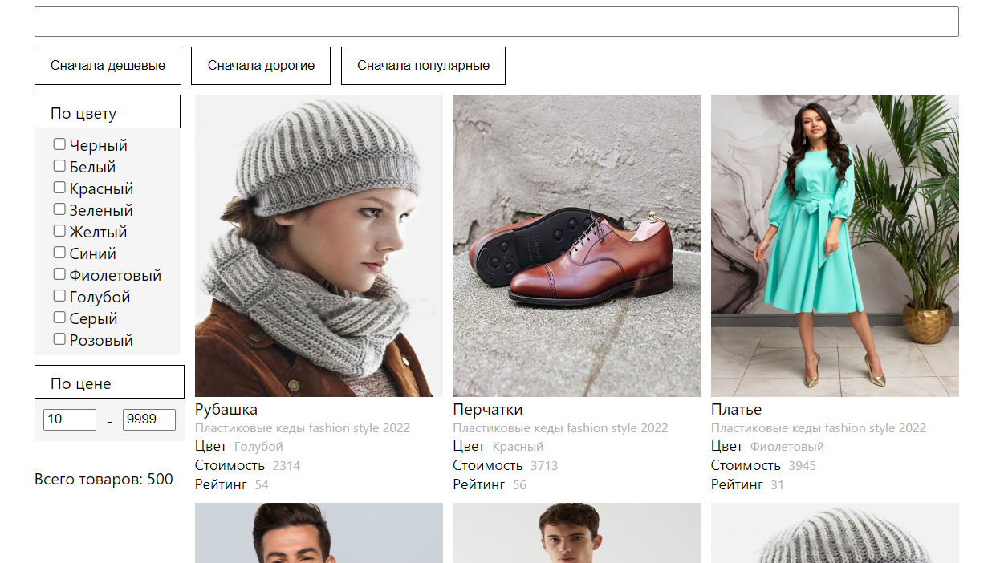

# React SPA & API

Simple React App to train usage of hooks.

To check this project visit https://lamoda-kichnorim.vercel.app/.

## Preview

## Technologies

- React
- CSS 

## Project Features

- Generating of products, specifying quantity (default: 500)
- Sorting by price (ASC/DESC) and rating (DESC)
- Using multiple filters:
  - Filter by name
  - Filter by selected colors
  - Filter by price interval
- Components are ready to be reused

## Local install

### Pre-requirements:

- Node and NPM installed on your device

### Installation

- Clone this repository
- Run `npm install` in cloned folder
- Run `npm start` or `npm run start` to start project locally
